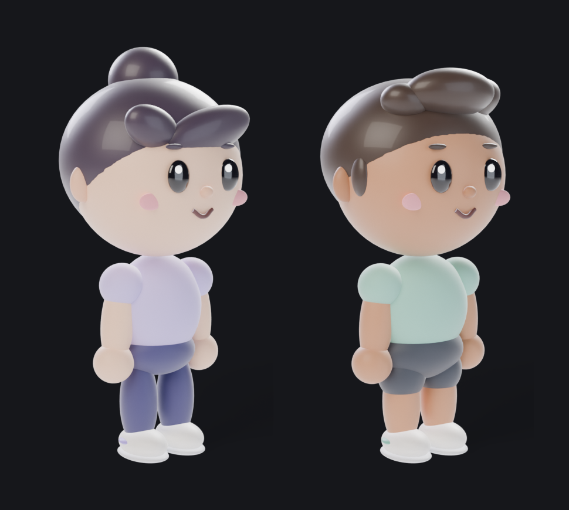

# Tracko characters

Two playful clay characters, female and male, who act out the onboarding story: walking into the gym, lifting, logging the set, and celebrating when the number goes up. They're built from one recipe, so they always match.



## Files

| File | What it is |
|---|---|
| `cast.png` | Both characters side by side, on the app's ink background |
| `female/sheet.png`, `male/sheet.png` | Character sheets: front, three-quarter, side and back, plus the four expressions |
| `female/gym-log-preview.mp4`, `male/gym-log-preview.mp4` | The gym log clip on ink, with the +7% pop-up drawn in, for reviewing |
| `female/gym-log.webm`, `male/gym-log.webm` | The same clip with a transparent background and no pop-up: the master for the app |
| `gym-log-timing.json` | Frame and second marks for each beat; the app syncs its overlay (the +% pop-up) to `popup` |
| `build/` | The Blender script that builds and animates the characters, and the render pipeline |

## The gym log clip

8 seconds at 24 fps (192 frames):

| Frames | Beat |
|---|---|
| 1–36 | Walks in from the left |
| 36–44 | Stops, turns to the camera |
| 44–58 | Looks at their hands; dumbbells pop in |
| 58–118 | Three lateral raises, straining (`> <` eyes) at the top of each |
| 118–146 | Dumbbells away; phone out; taps the set in |
| 148 | **The +% pops up** (drawn by the app); they look up, surprised |
| 152–172 | Crouches, jumps with arms up, happy |
| 172–192 | Lands and bounces happily to the end |

The pop-up isn't rendered into the transparent clip, because its number has to come from `LiftMath`. The preview shows "+7%".

## Style rules

- **Chibi clay.** The head is about 40% of the height, the limbs are short and rounded, and everything is matte, smooth and made from soft rounded shapes. The reference is soft 3D clay animals, made human.
- **Faces stay simple.** Dot eyes with one sparkle, pink blush, a small nose, a line smile. Expressions swap instantly rather than morphing: neutral, effort (`> <`), surprised, happy (`^ ^`).
- **The two characters differ only in their spec:** skin, hair (bun with a side fringe, or a quiff), outfit (leggings, or shorts) and build. Proportions, faces and animation are shared, so any new clip works for both.
- **Colours never borrow the app's signals.** Clothes are soft lilac, mint, indigo and charcoal. No red (red means trained muscles) and no Tracko yellow or green (target and gain).
- **Props are oversized** (dumbbells, phone) so they read at onboarding size.
- **Lit for the dark app.** A warm key light, a cool fill, and two shadowless rim lights that keep dark hair separate from the ink background.

## Re-rendering and adding clips

You need Blender 4.5 LTS, Pillow and ffmpeg (libx264, libvpx-vp9).

```
python3 characters/build/render_all.py stills   # sheets and cast.png
python3 characters/build/render_all.py anim     # clip frames (about 25 min per character on 4 cores)
python3 characters/build/render_all.py post     # preview .mp4, transparent .webm, timing.json
```

Set `BLENDER=/path/to/blender` if it isn't at the default path. To change a character, edit `SPECS` in `build/tracko_characters.py`. To add a clip, write another `animate_…` function next to `animate_gym_log`, using the same pose helpers (`set_arm`, `set_leg`, `key_expression`).

## Using a clip in the app

iOS plays transparent video as HEVC with alpha. On a Mac:

```
ffmpeg -c:v libvpx-vp9 -i female/gym-log.webm -c:v hevc_videotoolbox -alpha_quality 0.75 -tag:v hvc1 female/gym-log.mov
```

Play it with `AVPlayer` in a transparent `AVPlayerLayer`, and draw the +% pop-up in SwiftUI at `popup` from `gym-log-timing.json`. These renders are 640 px, which is enough for a stage about 300 pt wide; for final quality, re-render at 1080 px with more samples on a faster machine.
