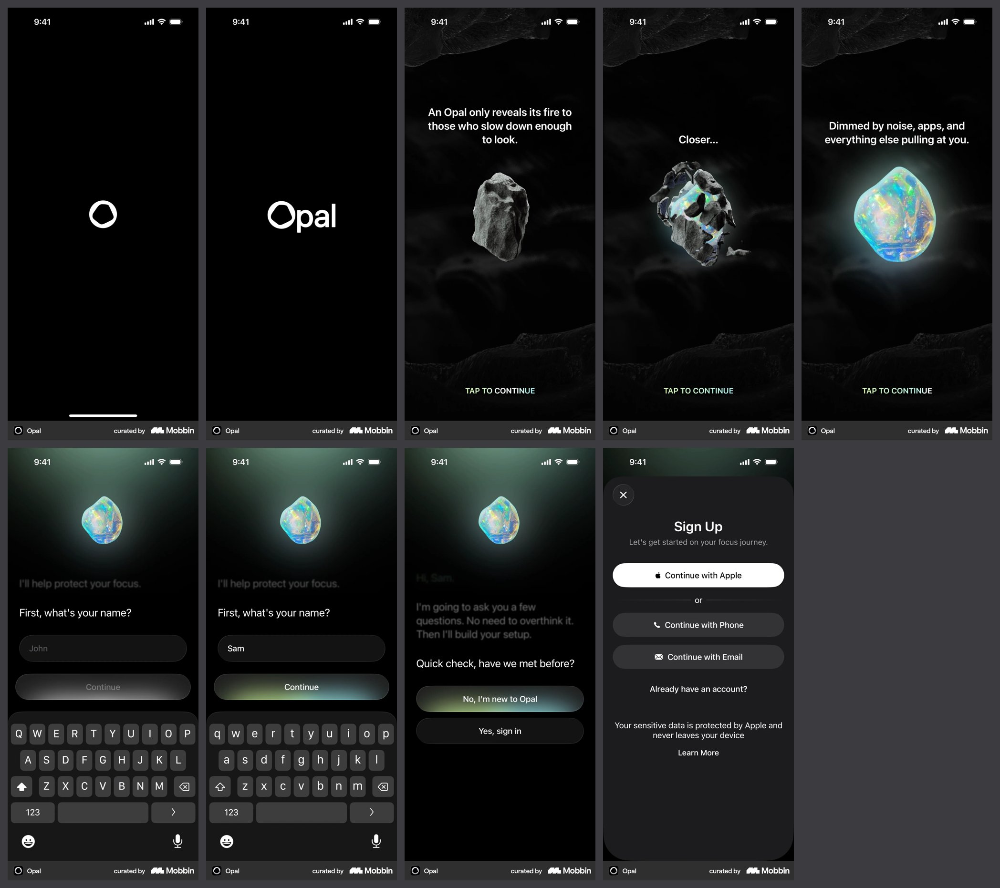
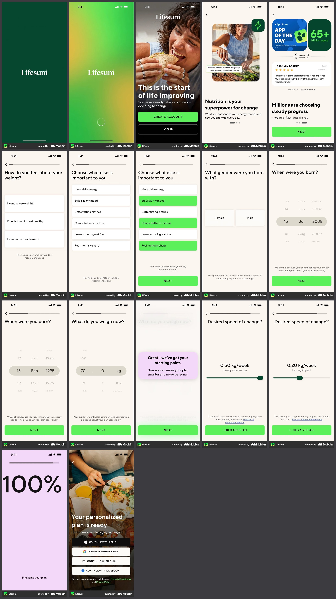
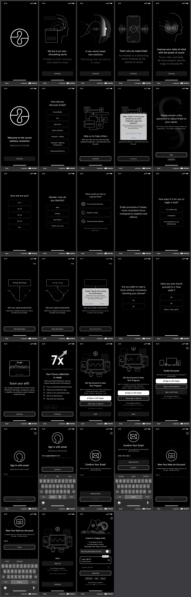
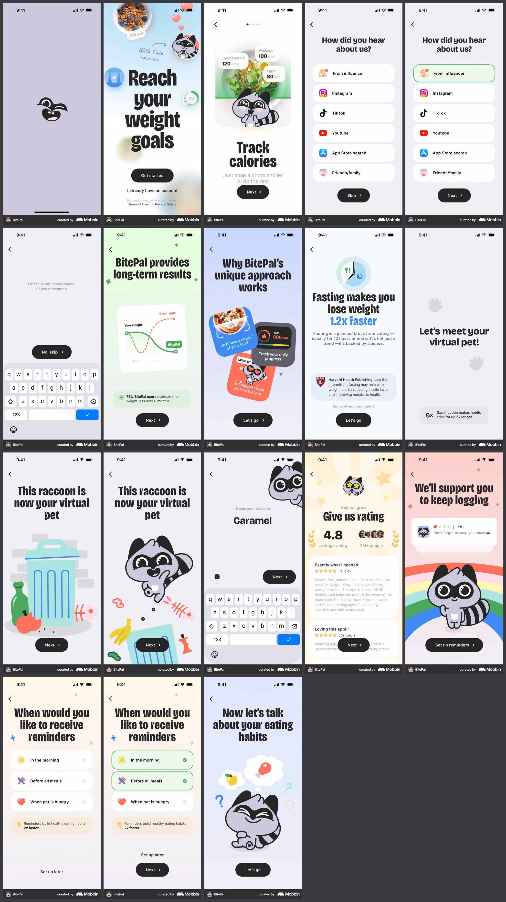
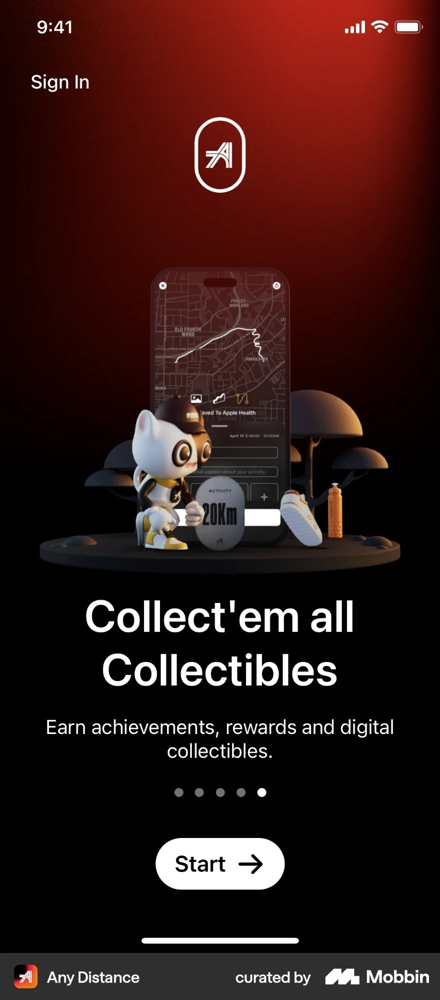

# UI reference library

Screenshots and recordings from other apps that set the bar for how Tracko should look and feel. Every UI change should be able to point at a reference here, or at a pattern below.

## How it works

- **Adding references:** send screenshots or links (Mobbin flows work) in a Claude session, or upload files to `inbox/` on GitHub. Claude files each one and writes a short entry below.
- **Mobbin links:** `python3 design/references/tools/fetch_mobbin.py <link> <NNN>` downloads every screen at full size, the flow recording when there is one, and overview sheets.
- **Naming:** single screens are `NNN-source-subject.jpg`. A flow gets one number: its screens are `NNN-source-flow-01.jpg`, `-02`, … in order, plus a `-sheet.jpg` overview. A recording is kept as `NNN-source-flow.mp4`, with a `-timeline.jpg` of frames for studying motion.
- **Entries are filing only:** what it is, what's in it, and the source. What to extract from a reference is decided later, by the product owner; when that happens, a **Take** note is added to the entry and the takeaway goes into **Patterns**.
- **Priority:** the product owner ranks references. The **Priority** list below comes first whenever references disagree.
- **Citing:** refer to a reference by number ("use 002's progress bar"). Numbers never change, and deleted numbers are not reused.
- **Patterns:** agreed takeaways, written here first, then turned into design tokens and rules in the Tracko skill (§9) when applied to the app.

## Priority

Both are priority 1.

- **005 · Any Distance onboarding.** Exactly how the owner wants Tracko's onboarding to look. Its 3D character matches Tracko's characters (`characters/`).
- **004 · BitePal onboarding.** The bar for illustration and storytelling: the owner wants Tracko's illustrations to be like this, likes the story, and likes how it shows what users can do with the app.

## Before

The onboarding as of v0.1 (the code CI screenshots on every push), kept for before-and-after comparison:
[iPhone 17 Pro](../baseline/v0.1-iphone-17-pro.jpg) · [iPhone SE](../baseline/v0.1-iphone-se.jpg).

## Patterns

_None yet._

## References

### 001 · Opal · iOS onboarding

- **What it is:** onboarding for Opal, a screen-time app. 9 screens and a 42 s recording.
- **Screens:** logo, wordmark, a three-tap story where a dark rock cracks open into a glowing opal ("An Opal only reveals its fire to those who slow down enough to look." / "Closer..." / "Dimmed by noise, apps, and everything else pulling at you."), then a setup run as a typed conversation (name, "have we met before?"), then a sign-up sheet.
- **Files:** screens `001-opal-onboarding-1-logo.jpg` to `-9-sign-up.jpg` · recording [001-opal-onboarding.mp4](001-opal-onboarding.mp4) · frames [001-opal-onboarding-timeline.jpg](001-opal-onboarding-timeline.jpg)
- **Source:** [Mobbin](https://mobbin.com/explore/flows/be4b5aa1-ba9d-494c-acbb-9ce8faa0d6f5)

### 002 · Lifesum · iOS onboarding

- **What it is:** onboarding for Lifesum, a nutrition and calorie app. 17 screens and a recording.
- **Screens:** splash, gradient splash, a photo welcome ("This is the start of life improving") with create account and log in, two value screens (nutrition, social proof with App of the Day, 65M+ users and a review), then a questionnaire with a progress bar: weight goal, priorities (multi-select), sex, birth date and weight on wheel pickers, a "Great, we've got your starting point" interstitial, pace of change on a slider, a full-screen "100%" plan-building screen, and a "Your personalized plan is ready" sign-up.
- **Files:** screens `002-lifesum-onboarding-01.jpg` to `-17.jpg` · recording [002-lifesum-onboarding.mp4](002-lifesum-onboarding.mp4) · frames [002-lifesum-onboarding-timeline.jpg](002-lifesum-onboarding-timeline.jpg)
- **Source:** [Mobbin](https://mobbin.com/explore/flows/f373ce15-3f4e-4d88-aa24-365969ad35eb)

### 003 · Endel · iOS onboarding

- **What it is:** onboarding for Endel, a focus and sleep sound app. 33 screens; Mobbin has no recording of this flow.
- **Owner's note:** really likes the illustration and the storytelling.
- **Screens:** logo; a four-screen story told with white line illustrations on black (a head beside a busy page, "We live in an over-stimulating world"; sound waves passing through a face, "A new world needs new solutions"; a phone radiating sound, "That's why we made Endel"; a head with a glowing centre, "Improve your state of mind with the power of sound"); a welcome screen; questions (how you discovered Endel, age, gender, goal, how easy it is to start a task, can you read without checking your phone, have you felt a flow state); illustrated permission asks for ad tracking ("Help us to help others") and reminders ("Get your peak productivity", a circadian curve); a "Soon you will!" proof screen comparing Endel to a static playlist; a "7x" focus summary; account setup and email sign-in; and a paywall with a moon-and-clouds face illustration ("Invest in a happy brain").
- **Files:** screens `003-endel-onboarding-01.jpg` to `-33.jpg`
- **Source:** [Mobbin](https://mobbin.com/explore/flows/33fa4e4a-2412-4396-94ae-99380009a403)

### 004 · BitePal · iOS onboarding (priority 1)

- **What it is:** onboarding for BitePal, a calorie-tracking app with a virtual raccoon pet. 18 screens and a recording.
- **Owner's note:** priority 1. Wants Tracko's illustrations to be like this; likes the story, and how it shows what users can do with the app.
- **Screens:** raccoon logo on lavender; welcome "Reach your weight goals", with a food bowl, a peeking raccoon and a hand-written "With cute raccoon" note; "Track calories: just snap a photo and let AI do the rest", with a salad card tagged with calories; "How did you hear about us?" (unselected and selected); influencer name; "BitePal provides long-term results", a weight chart against other apps; "Why BitePal's unique approach works", three tilted feature cards (snap a photo, track daily progress, support from your virtual pet); "Fasting makes you lose weight 1.2x faster" with a cited source; "Let's meet your virtual pet!"; "This raccoon is now your virtual pet" (it bursts out of a bin of food scraps); naming the pet ("Caramel"); a ratings screen (4.8, reviews); "We'll support you to keep logging", the raccoon on a rainbow with a reminder notification; reminder times (morning, before meals, when the pet is hungry); "Now let's talk about your eating habits", the raccoon thinking.
- **Look:** flat 2D cartoon mascot with thick outlines; a different soft pastel gradient on each screen; bold condensed black headlines; rounded white cards; black capsule "Next" buttons.
- **Files:** screens `004-bitepal-onboarding-01.jpg` to `-18.jpg` · recording [004-bitepal-onboarding.mp4](004-bitepal-onboarding.mp4) · frames [004-bitepal-onboarding-timeline.jpg](004-bitepal-onboarding-timeline.jpg)
- **Source:** [Mobbin](https://mobbin.com/explore/flows/3aca70bc-a1e3-4895-9a72-24dc68de3bf9)

### 005 · Any Distance · iOS onboarding, collectibles screen (priority 1)

- **What it is:** one onboarding screen from Any Distance, an activity-tracking app: the last of five pages ("Collect'em all Collectibles").
- **Owner's note:** priority 1. Exactly how the owner wants Tracko's onboarding to look; the 3D character matches Tracko's characters.
- **Screen:** black background with a deep red glow falling from the top; the app's logo in an outlined capsule; a 3D diorama on a dark round platform: a phone showing a running route on a dark map and a "20Km" activity medal, a clay-like 3D cat mascot in a cap and sneakers leaning on it, mushroom-shaped trees, a sneaker and a water bottle; a large bold white headline ("Collect'em all Collectibles") with a one-line subline ("Earn achievements, rewards and digital collectibles."); five page dots; a white capsule "Start →" button; "Sign In" at the top left.
- **Files:** `005-any-distance-onboarding-collectibles.jpg` (a single screen, sent as a screenshot)
- **Source:** screenshot from Mobbin (Any Distance, iOS)
